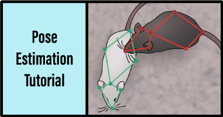
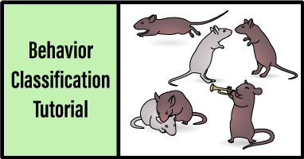

# MARS_Developer
This repository contains all the code you'll need to train your own version of MARS.

## Installation
To set up your GPU to run tensorflow, follow the "Setting up your GPU for Tensorflow" section of the instructions from the end-user version of MARS, followed **steps 1-2** of the instructions to install conda: [for Linux](https://github.com/neuroethology/MARS/blob/master/docs/install_linux_nvidia.md#setting-up-your-gpu-for-tensorflow) | [for Windows](https://github.com/neuroethology/MARS/blob/master/docs/install_windows_nvidia.md#setting-up-your-gpu-for-tensorflow)

Next, clone this Github repository + submodules with the call
```
git clone --recurse-submodules https://github.com/neuroethology/MARS_Developer
```

Navigate into the MARS_Developer directory you just created, and install the conda environment:
```
conda env create -f MARS_dev.yml
```
and activate this environment by calling
```
conda activate mars_dev
```
To be able to run jupyter notebooks from within the `MARS_dev` environment, use commands:
```
conda install -c anaconda ipykernel
python -m ipykernel install --user --name=mars_dev
```
Finally, to install the `MARSeval` module for evaluating performance of the detection and pose models:
**on Linux**
```
pip install git+https://github.com/neuroethology/MARS_pycocotools.git#egg=MARSeval\&subdirectory=PythonAPI
```
**on Windows**
* Install Microsoft Visual C++ Build Tools from [here](https://visualstudio.microsoft.com/visual-cpp-build-tools/).
```
pip install git+https://github.com/neuroethology/MARS_pycocotools.git#egg=MARSeval^&subdirectory=PythonAPI
```
## The MARS Workflow
MARS processes your videos in three steps:
1) **Detection** - detects the location of animals in each video frame.
2) **Pose estimation** - estimates the posture of each animal in terms of a set of anatomically defined "keypoints".
3) **Behavior classification** - detects social behaviors of interest based on the poses of each animal.

Each of these steps can be fine-tuned to your own data using the code in this repository.

To get started, please check out our two Tutorial notebooks:
[](https://nbviewer.jupyter.org/github/neuroethology/MARS_Developer/blob/master/MARS_pose_tutorial.ipynb) [](https://nbviewer.jupyter.org/github/neuroethology/MARS_Developer/blob/master/MARS_behavior_tutorial.ipynb)

## An Overview of the Training Process
Training MARS to run on your own experiments includes the following steps. We'll assume you have already settled on a recording setup, and have a set of videos on hand to be analyzed.

### 1) 📁 Create a new MARS Training Project.
MARS uses a set file strcture to keep track of data and models associated with your project.

### 2) ✍️ Collect a set of manually annotated animal poses.
We provide code for crowdsourcing of pose annotation to a public workforce via Amazon SageMaker. Running this code requires an Amazon Web Services (AWS) account and some initial time investment in setting up the custom annotation job. A typical pose annotation job, at high annotation quality + high label confidence (5 repeat annotations/image) costs ~68 cents/image.

If you've already collected pose annotations via another interface such as [DeepLabCut](https://github.com/DeepLabCut/DeepLabCut/blob/master/docs/UseOverviewGuide.md#label-frames), you can skip directly to the post-processing step to format your data for training.

### 3) 🎯 Fine-tune the MARS mouse detector to your data.
Next, we need to teach MARS what your animals look like. The [Multibox Detection module](multibox_detection) covers training, validating, and testing your mouse detector.

### 4) 🐁 Fine-tune the MARS pose estimator to your data.
Once you can detect your mice, we want to estimate their poses. In this step we'll train and evaluate a mouse pose estimator for your videos. The [Hourglass Pose module](hourglass_pose) covers training, validating, and testing a stacked hourglass model for animal pose estimation.

### 5) 🚀 Deploy your new detection and pose models.
Now that you have a working detector and pose estimator, we'll add them to your end-user version of MARS so you can run them on new videos!

### 6) 💪 Train new behavior classifiers. (behavior tutorial notebook)
Once you've applied your trained pose estimator on some new behavior videos, you can annotate behaviors of interest in those videos and train MARS to detect those behaviors automatically.
