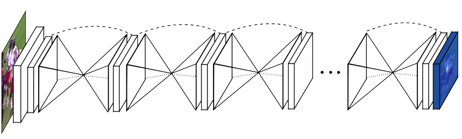

# POSE ESTIMATION - STACKED HOURGLASS NETWORK

This is an implementation of **Stacked Hourglass Networks for Human Pose Estimation**, proposed by Newell et al. and adapted by us for mouse pose estimation in MARS.

The original Stacked Hourglass paper can be found at [https://arxiv.org/abs/1603.06937](https://arxiv.org/abs/1603.06937). Towards Data Science also has [a helpful write-up](https://towardsdatascience.com/human-pose-estimation-with-stacked-hourglass-network-and-tensorflow-c4e9f84fd3ce) on human pose estimation using the stacked hourglass network, by Ethan Yanjia Li.

Trained pose models can be found [here](https://data.caltech.edu/records/1655) in MARS_v1_8_models.zip. MARS pose annotation training/test data can be found [here](https://data.caltech.edu/records/2011).

##### System Requirements

For training MARS, we used an HPZ640 Workstation with an 8-core Intel Xeon CPU, 24 GB of RAM, and a 12 GB Titan Xp.

That said, training MARS predominantly makes use of the GPU, so training speed is mostly dependent on the quality of your
GPU --we've also trained models using a GTX 960, but that can take ~30-50% more time.

###  Associated files
**The documentation below is intended for developers- to train a pose model, please refer to `MARS_tutorial.ipynb` in the parent directory.**

#### tfrecords

Ahead of training, the raw training data gets packaged into a tfrecord file; this is performed by scripts within `pose_annotation_tools/annotation_postprocessing.py`. The tfrecord has the following fields:

|Key|	                       Value|
|---------------------|-----------|
|image/id	      |         string containing an identifier for this image.|
|image/filename |            string containing a file system path to the of the image file.|
|image/encoded	 |          string containing JPEG encoded image in RGB colorspace|
|image/height	 |          integer, image height in pixels|
|image/width	 |              integer,  image width in pixels|
|image/colorspace	|       string, specifying the colorspace, e.g. 'RGB'|
|image/channels	 |          integer, specifying the number of channels, e.g. 3|
|image/format	  |         string, specifying the format, e.g. 'JPEG'|
|image/extra	  |             string, any extra data can be stored here. For example, this can be a string encoded json structure.|
|image/class/label|	       integer specifying the index in a classification layer. The label ranges from [0, num_labels), e.g 0-99 if there are 100 classes.|
|image/class/text	|       string specifying the human-readable version of the label |
|image/class/conf	|       float value specifying the confidence of the label. For example, a probability output from a classifier.|
|image/object/count	|       an integer, the number of object annotations. For example, this should match the number of bounding boxes.|
|image/object/area	|       a float array of object areas; normalized coordinates. For example, the simplest case would simply be the area of the bounding boxes. Or it could be the size of the segmentation. Normalized in this case means that the area is divided by the (image width x image height)|
|image/object/id	 |          an array of strings indicating the id of each object.|
|image/object/bbox/xmin	|   a float array, the left edge of the bounding boxes; normalized coordinates.|
|image/object/bbox/xmax	|   a float array, the right edge of the bounding boxes; normalized coordinates.|
|image/object/bbox/ymin	|   a float array, the top left corner of the bounding boxes; normalized coordinates.|
|image/object/bbox/ymax	|   a float array, the top edge of the bounding boxes; normalized coordinates.|
|image/object/bbox/score	|   a float array, the score for the bounding box. For example, the confidence of a detector.|
|image/object/bbox/label|	   an integer array, specifying the index in a classification layer. The label ranges from [0, num_labels)|
|image/object/bbox/text|	   an array of strings, specifying the human readable label for the bounding box.|
|image/object/bbox/conf	|   a float array, the confidence of the label for the bounding box. For example, a probability output from a classifier.|
|image/object/parts/x	 |  a float array of x locations for a part; normalized coordinates.|
|image/object/parts/y	|   a float array of y locations for a part; normalized coordinates.|
|image/object/parts/v	|   an integer array of visibility flags for the parts. 0 indicates the part is not visible (e.g. out of the image plane). 1 indicates the part is occluded. 2 indicates the part is visible.|
|image/object/parts/score |  a float array of scores for the parts. For example, the confidence of a keypoint localizer.|

*Take note:*
* Many of the above fields can be empty. Most of the different systems using the tfrecords will only need a subset of the fields.
* The bounding box coordinates, part coordinates and areas need to be normalized. For the bounding boxes and parts this means that the x values have been divided by the width of the image, and the y values have been divided by the height of the image. This ensures that the pixel location can be recovered on any (aspect-perserved) resized version of the original image. The areas are normalized by they area of the image.
* The origin of an image is the top left. All pixel locations will be interpreted with respect to that origin.

#### Config files

Config files contain model hyperparameters that are used during training. You do not need to create these yourself- they are created in your project directory when it is initialized.

Configuration parameters include:
  - **Keypoint Parameters**
      * PARTS:
          * NUM_PARTS: the number of parts
          * LEFT\_RIGHT\_PAIRS: pairs of indices corresponding to symmetric parts (e.g. [1,2] for the ears)
          * NAMES: labels of the parts (e.g. ['right_ear','left_ear',...])
          * SIGMAS: Heatmaps are made by taking the keypoint location and convolving it with a 2d gaussian --this list of floats is the standard deviation of the gaussian for each part.
  - **Image Augmentation Parameters**
      * LOOSE\_BBOX\_CROP: when set to true, allows you to expand the bbox by the fraction specified in LOOSE\_BBOX\_PAD\_FACTOR
          * LOOSE\_BBOX\_PAD\_FACTOR: if the above is set to true, expands the bbox by this fraction.
      * DO_RANDOM_PADDING: when set to true, uses a bounding box of variable size to train on.
	  * RANDOM_PADDING_FREQ: The frequency with which to use a random bounding box padding, otherwise we use LOOSE_BBOX_PAD_FACTOR.
	  * RANDOM_PADDING_MIN: The minimum padding percentage possible to randomly draw.
	  * RANDOM_PADDING_MAX: The maximum padding percentage possible to randomly draw.
      * DO_COLOR_DISTORTION: The fraction of the time we should distort the color (by modifying gamma, contrast, or brightness.)
      * DO_RANDOM_BLURRING: when set to true, applies a gaussian blur to the input image.
          * RANDOM_BLUR_FREQ: The frequency with which to apply this blur.
          * MAX_BLUR: The maximum size of the blurring kernel.
      * DO_RANDOM_NOISE: when set to true, applies gaussian white noise to the image.
          * RANDOM_NOISE_FREQ: The frequency with which to apply the above noise.
          * RANDOM_NOISE_SCALE: The standard deviation of the noise generator.
      * DO_RANDOM_ROTATION: When set to true, allows us to rotate the image.
          * RANDOM_ROTATION_FREQ: The frequency with which to rotate the image.
          * RANDOM_ROTATION_DELTA: The maximum change in angular orientation (in degrees).
      * DO_JPEG_ARTIFACTS: When set to true, allows the application of jpeg degradation to images.
          * RANDOM_JPEG_FREQ: Frequency with which to perform jpeg degradation.
          * RANDOM_JPEG_QUALITY_MIN: The minimum quality of the jpeg encoding.
          * RANDOM_JPEG_QUALITY_MAX: The maximum quality of the jpeg encoding.
      * DO_RANDOM_BBOX_SHIFT:  Ther frequency with which to perturb the coordinates of the bounding box --As in (1), we set this to 0.
      * DO_RANDOM_FLIP_LEFT_RIGHT: The frequency with which to use horizontally-flipped images. This should help with model generalization, assuming that our model is left-right independent (and it should be).
  - **Input Queue Parameters**
      * NUM_INPUT_THREADS:  The number of threads to use, when constructing input examples. Depends on your hardware setup --generally you want as many threads as processor cores.
      * BATCH_SIZE: The number of images to process in one iteration. Depending on your hardware setup, you will need to adjust this parameter so that everything fits in memory.
      * NUM_TRAIN_EXAMPLES: The number of training examples in your dataset. This, along with BATCH_SIZE, is used to compute the number of iterations in an epoch (an epoch has passed when all examples have been seen once).
      * NUM_TRAIN_ITERATIONS: The maximum number of training iterations to perform before stopping.
  - **Learning Parameters**
      * LEARNING_RATE_DECAY_TYPE: Choose between *fixed*,*exponential*, and *polynomial*. At the moment, only fixed is implemented.
      * INITIAL_LEARNING_RATE: As in (1), we use 0.00025.

You'll definitely want to go through the other configuration parameters, but make sure you have the above parameters set correctly.